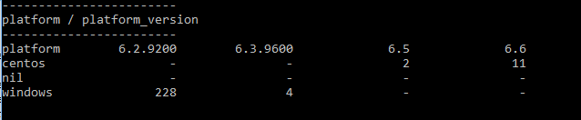

Chef Node Matrix
================

What is it?

This is a program that will perform a count based on the intersection of two Node Attributes.

For example, are you interested in the distribution of platforms and their versions?



Perhaps the spread of Chef client versions?

## Requirements

You will need
* Ruby (ideally with ChefDK)
* Chef or ChefDK
* Chef configuration file - knife.rb or client.rb

## Usage

Simply call the program from the command line and provide an attribute (or attributes) for the row and the column values.

The attribute value is represented in dot notation, if your attribute is

````
default['myapp']['mysettings']['version'] = '6.5'
````

Then use myapp.mysettings.version, the program uses the attribute value as a row or column heading and counts the number of instances in your infrastructure.

Parameters are

 Parameter                                          |  Description                                | Default        
----------------------------------------------------|---------------------------------------------|---------------------
`-c <config_file> or --config <config_file>`        | Location of the Chef configuration file     | `~/.chef/knife.rb` 
`--row <attributes>`                                | Attributes used for matrix row              | `none`
`--col <attributes>`                                | Attributes used for matrix column           | `none`

Some examples below

ruby chef_node_matrix.rb --row chef_environment --col chef_packages.chef.version
ruby chef_node_matrix.rb --row chef_environment --col "platform,platform_version"
ruby chef_node_matrix.rb --row platform --col platform_version

If providing more than one attribute per axis then seperate the attribute path with a comma.

## License

Feel free to download, contribute or suggest improvements.